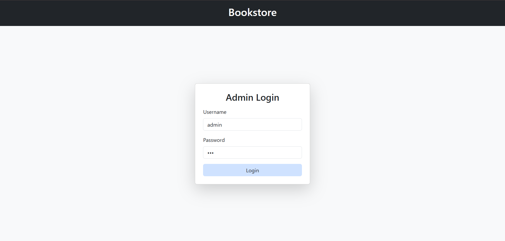
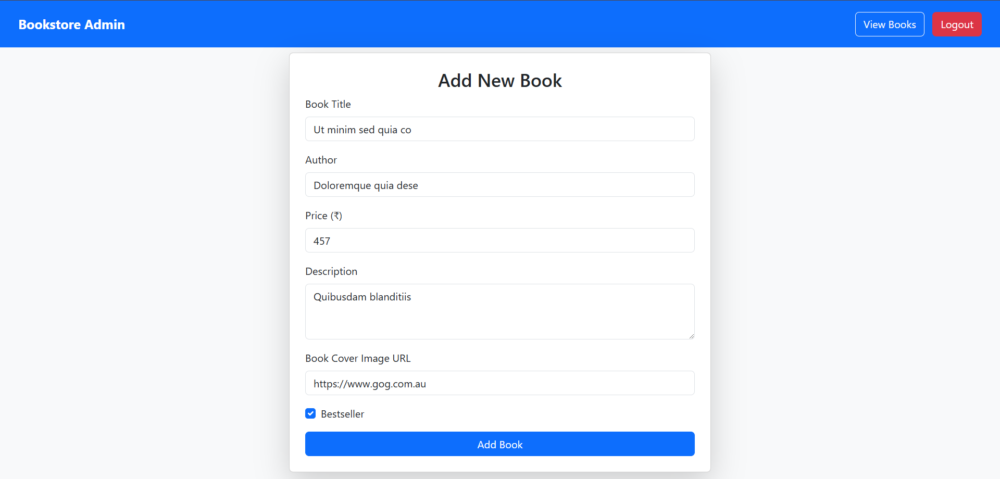
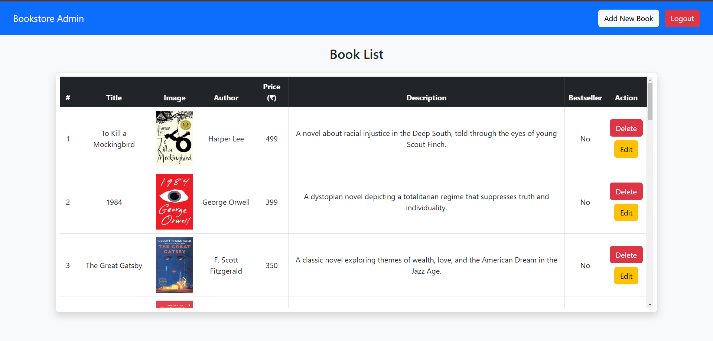
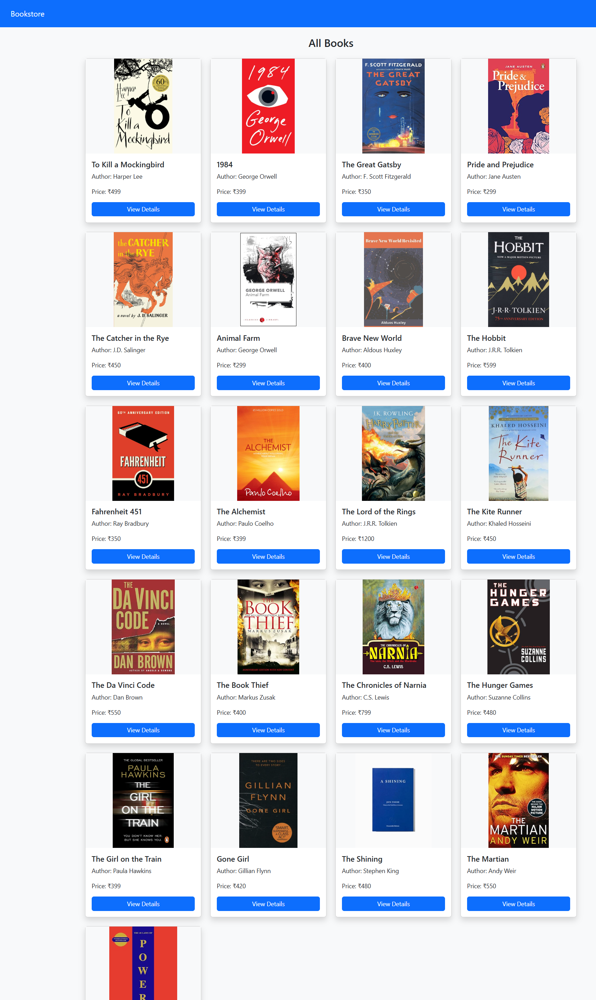

# Book Store Web Application

A full-stack web application for managing and showcasing books with admin panel functionality. Built with Node.js, Express, MongoDB, and EJS templates.

## Project Structure
```
book-store/
├── configs/
│   └── database.js      # MongoDB connection configuration
├── models/
│   └── bookStoreSchema.js # Mongoose schema for books
├── views/
│   ├── allbooks.ejs    # Display all books page
│   ├── edit.ejs        # Edit book form
│   ├── form.ejs        # Add new book form
│   ├── index.ejs       # Home page with featured books
│   ├── list.ejs        # Admin book list table
│   └── login.ejs       # Admin login page
├── index.js            # Main application entry point
└── package.json        # Project dependencies and scripts
```

## Features

### Client Side
- Responsive home page with book slider
- Best seller and popular book sections
- View all books page with card layout
- Book details placeholder pages

### Admin Panel
- Secure login system
- CRUD operations for books:
  - Add new books with image URLs
  - Edit existing book details
  - Delete books
  - View all books in table format
- Form validation
- Admin session management

## Prerequisites

- Node.js (v16+)
- npm
- MongoDB Atlas account or local MongoDB instance
- Modern web browser

## Installation

1. Clone the repository:
   ```bash
   git clone https://github.com/Shubhamparekh04/Book-store.git
   cd Book-store
   ```

2. Install dependencies:
   ```bash
   npm install
   ```

3. Configure MongoDB:
   - Update the connection string in `configs/database.js`
   ```js
   mongoose.connect("mongodb+srv://<username>:<password>@cluster0.updlh.mongodb.net/book-store");
   ```

## Configuration

### Database Connection
- Configured in `configs/database.js`
- Uses Mongoose ODM
- Connection events handling

### Book Model
- Defined in `models/bookStoreSchema.js`
- Fields:
  - **Title** (required, unique)
  - **Author** (required)
  - **Price** (required)
  - **Description**
  - **Image URL**
  - **Bestseller status**

## Running the Application

### Development Mode
```bash
npm run dev
```
- Uses `nodemon` for live reloading
- Access at: [http://localhost:8090](http://localhost:8090)

### Production Mode
```bash
npm start
```

## Admin Access
**Credentials (For demonstration purposes only)**
- **Username:** admin
- **Password:** 123

## Technologies Used
- **Backend:** Node.js, Express
- **Database:** MongoDB, Mongoose
- **Frontend:** EJS, Bootstrap 5
- **Tools:** Nodemon

## Security Notes
- Replace default admin credentials in production
- Use environment variables for sensitive data
- Implement proper session management
- Add input sanitization for forms

## Screenshots
1. Login.ejs:


2. Form.ejs:


3. Books.ejs:
 

4. Index.ejs:


5. Allbooks.ejs:


## Contributing
1. Fork the repository
2. Create your feature branch
3. Commit your changes
4. Push to the branch
5. Create a Pull Request

## License
ISC © Shubham Parekh

